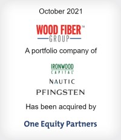
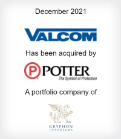

## [Raymond James]("https://www.raymondjames.com/corporations-and-institutions/investment-banking/transaction-history?industry=0&sector=0&transaction=0&r=10")

### Woodfiber Group

Wood Fiber Group is the market leading
 
manufacturer and supplier of saws, knives, 
 
equipment and consumable supplies to the 
 
North American wood processing industry.

### Reeb Millwork

Headquartered in Bethlehem, Pennsylvania, 
 
Reeb is a market-leading, value-added fabricator
 
and supplier of interior and exterior doors,
 
providing highly customized products to a 
 
diversified customer base.

### Valcom

For more than 40 years, Valcom Inc. has 
 
been a leader in the development of 
 
communications products and solutions
 
that relay information rapidly, enabling 
 
individuals in various locations throughout 
 
an organization to receive relevant 
 
instructions.

---

## Consilium Partners    

### [Gerard Daniel Worldwide]("https://www.cpboston.com/tombstones/gerard-daniel-worldwide/")

### [Dynawave Inc. and Dynawave Cable Inc.]("https://www.cpboston.com/tombstones/dynawave-inc-and-dynawave-cable-inc-dynawave/")

