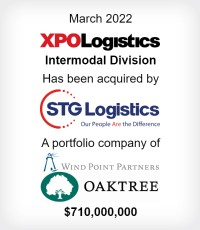
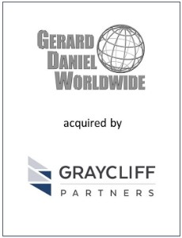

# Representative Transaction Experience

## [Raymond James](https://www.raymondjames.com/corporations-and-institutions/investment-banking/transaction-history?industry=0&sector=0&transaction=0&r=10)
_(transaction list and details available at the above link)_

### Wood Fiber Group

Wood Fiber Group is the market leading
 
manufacturer and supplier of saws, knives, 
 
equipment and consumable supplies to the 
 
North American wood processing industry.

### Reeb Millwork

Headquartered in Bethlehem, Pennsylvania, 
 
Reeb is a market-leading, value-added fabricator
 
and supplier of interior and exterior doors,
 
providing highly customized products to a 
 
diversified customer base.

### Valcom Inc.

For more than 40 years, Valcom Inc. has 
 
been a leader in the development of 
 
communications products and solutions
 
that relay information rapidly, enabling 
 
individuals in various locations throughout 
 
an organization to receive relevant 
 
instructions.

### XPO Logistics

Headquartered in Greenwich, Connecticut, 
 
XPO Logistics, Inc. is a leading provider 
 
of freight transportation services, primarily
 
truck brokerage and less-than-truckload 
 
capacity in North America

---

## Consilium Partners    
_(transaction details available at links below)_

### [Gerard Daniel Worldwide](https://www.cpboston.com/tombstones/gerard-daniel-worldwide/)

Gerard Daniel Worldwide, Inc. is a leading 
 
manufacturer and distributor of wire mesh
 
and other wire products used in a variety 
 
of applications and end markets.

### [Dynawave Inc. and Dynawave Cable Inc.](https://www.cpboston.com/tombstones/dynawave-inc-and-dynawave-cable-inc-dynawave/)

Dynawave designs and manufactures RF
 
and microwave interconnect solutions